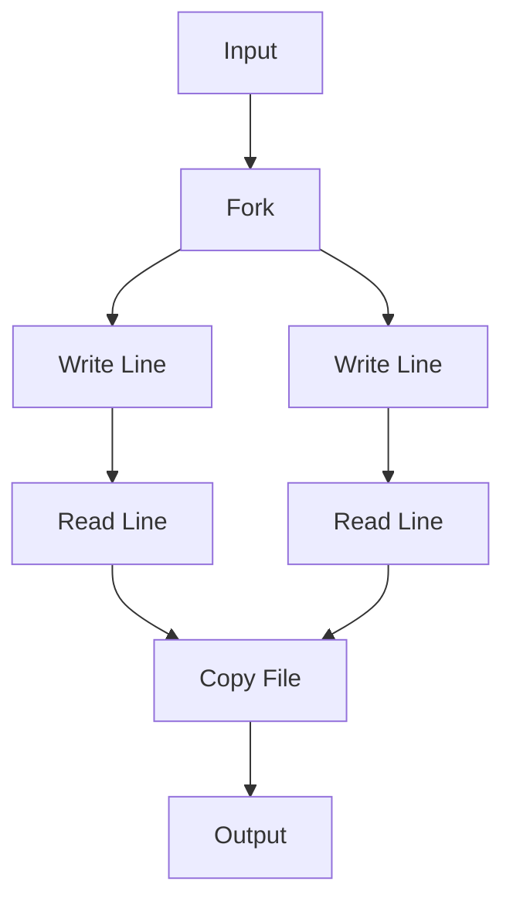

Last time, I wrote about the options we've discovered for sequencing effects into little programs.
Each of these systems has tradeoffs, and we dug into how they each exist on the spectrum between being **expressive** or **analyzable**.

So far we've looked at Monads, Applicatives, and Selective Applicatives; but 
at the end of the post we were left wanting something better. 
Monads can express all the possible programs we may want to write, but offer essentially no analysis 
of the program it encodes. 

Applicatives and Selective Applicatives offer reasonable program analysis, but are unable
to express complex programs, or even programs in which downstream effects materially depend on the results of upstream effects.

In this post we'll set aside the Functor-Applicative-Monad hierarchy and rebuild on 
an altogether different foundation.

## What do we want?

Before putting in the work, we should think about what's missing from the systems we've already explored, and what we wish to gain from a new system.

Here's my personal wish-list for our new system:

* Given any program in the new effect system I should be able to list every effect that program might perform.
* I want to understand the _dependencies_ between the effects including the flow of data between them.
* I want to be able to express programs in which downstream effects can fully utilize the results of upstream effects.

Looking at these requirements, the biggest problem with the Monadic effects system is that it's far too rough-grained in how it handles the results of previous effects.

Reviewing the signature of bind:

```haskell
(>>=) :: Monad m => m a -> (a -> m b) -> m b
```

We can see that the result from a previous effect is passed to a function whose job is to return 
the _entire_ continuation of the program. This allows the entire program to be swapped out based on the result of a previous effect, 
which is far too permissive for us, we need to put some more constraints on this.

We need to somehow allow programs to use values from effects like this, but they should route this input
through their program in a way that's encoded in the structure of the system itself.

So for each effect, we should track not only its output, but it's inputs too!

We also know that we need to be able to chain these effects together, so we need some way to compose them.

Perhaps it's obvious where I'm going with this, so let me get to the point: we can encode this using the Category typeclass.

```haskell
class Category k where
  id :: k a a
  (.) :: k b c -> k a b -> k a c
```

This already gives us a lot of what we want.
Let's begin to re-implement the examples from the previous post using this new Category-based effect system.

I'll save you from clicking over, here's a refresher on the example program we wrote using Applicatives:


```haskell
import Control.Applicative (liftA3)
import Control.Monad.Writer (Writer, runWriter, tell)

class (Applicative m) => ReadWrite m where
  readLine :: m String
  writeLine :: String -> m ()

data Command
  = ReadLine
  | WriteLine String
  deriving (Show)

-- | We can implement an instance which runs a dummy interpreter that simply records the commands
-- the program wants to run, without actually executing anything for real.
instance ReadWrite (Writer [Command]) where
  readLine = tell [ReadLine] *> pure "Simulated User Input"
  writeLine msg = tell [WriteLine msg]

-- | A helper to run our program and get the list of commands it would execute
recordCommands :: Writer [Command] String -> [Command]
recordCommands w = snd (runWriter w)

-- | A simple program that greets the user.
myProgram :: (ReadWrite m) => String -> m String
myProgram greeting =
  liftA3
    (\_ name _ -> name)
    (writeLine (greeting <> ", what is your name?"))
    readLine
    (writeLine "Welcome!")

-- We can now run our program in the Writer applicative to see what it would do!
main :: IO ()
main = do
  let commands = recordCommands (myProgram "Hello")
  print commands

-- [WriteLine "Hello, what is your name?",ReadLine,WriteLine "Welcome!"]
```

The key aspects of this Applicative version were that we could analyze any program
which required only an Applicative constraint to get the full list of sequential effects
that the program would perform.

Here's the same program, but this time we'll encode the effects using Category 
constraints instead.
But first, a disclaimer: the syntax I use with this new system
is ugly. No, I don't expect anyone to use it when it looks like this, see the discussion 
on syntax at the end, but bear with me for now.

```haskell
import Control.Category
import Data.Profunctor
import Prelude hiding (id)

-- Here's how command interface.
class (Category k) => ReadWrite k where
  -- Readline has no interesting input, so we use () as input type.
  readLine :: k () String

  -- We track the inputs for the writeLine directly in the Category structure.
  writeLine :: k String ()

-- The Category hierarchy is a bit more granular, to lift Haskell values and functions
-- into our Category structure we also need a Profunctor instance.
-- `mapC` and `pureC` are the equivalents of `<*>` and `pure` for our Category.
-- This may seem annoying at first, but we'll see soon that having these as separate
-- classes gives us a lot more flexibility.
--
-- Profunctor + Category is enough to import any Haskell value or function into our Category.
mapC :: (Category k, Profunctor k) => (a -> b) -> k a b
mapC f = rmap f id

-- Embed a Haskell value into our Category.
pureC :: (Category k, Profunctor k) => b -> k a b
pureC b = mapC (\_ -> b)

-- | A simple program which uses a statically provided message to greet the user.
myProgram :: (ReadWrite k, Profunctor k) => String -> k () ()
myProgram greeting =
  pureC (greeting <> ", what is your name?")
    >>> writeLine
    >>> readLine
    >>> pureC "Welcome!"
    >>> writeLine
```

Just like the Applicative version, we can analyze any program which requires only a `ReadWrite` constraint by implementing an instance of `ReadWrite` for a type which records the commands it would execute.

```haskell
data Command
  = ReadLine
  | WriteLine
  deriving (Show)

-- Just like the applicative we create a custom implementation of the interface which for static analysis.
data CommandRecorder i o = CommandRecorder [Command]

instance Category CommandRecorder where
  -- The identity command does nothing, so it records no commands.
  id = CommandRecorder []

  -- Composition of two CommandRecorders concatenates their command lists.
  (CommandRecorder cmds2) . (CommandRecorder cmds1) = CommandRecorder (cmds1 <> cmds2)

instance Profunctor CommandRecorder where
  -- Mapping over values doesn't run any effects, so we don't bother track them.
  dimap _ _ (CommandRecorder cmds) = CommandRecorder cmds

-- | Our dummy instance simply records the commands the program wants to run, 
-- without actually executing anything for real.
instance ReadWrite CommandRecorder where
  readLine = CommandRecorder [ReadLine]
  writeLine = CommandRecorder [WriteLine]

-- | A helper to run our program and get the list of commands it would execute
recordCommands :: CommandRecorder i o -> [Command]
recordCommands (CommandRecorder cmds) = cmds

-- We can now run our program in the Writer applicative to see what it would do!
analyze :: IO ()
analyze = do
  let commands = recordCommands (myProgram "Hello")
  print commands
-- [WriteLine, ReadLine, WriteLine]
```

Fantastic, and if we want to _actually_ execute our program, we can implement a real interpreter too.
We can get a valid Category for every monad using the `Kleisli` newtype wrapper.

In this case we'll embed our IO monadic effects into a Category using `Kleisli IO`.


```haskell
instance ReadWrite (Kleisli IO) where
  readLine = Kleisli $ \() -> Prelude.getLine
  writeLine = Kleisli $ \msg -> Prelude.putStrLn msg

run :: IO ()
run = do
  let program = myProgram "Hello"
  runKleisli program ()
```

```
>>> run
Hello, what is your name?
Chris
Welcome!
```

Okay, we've achieved the ability to analyze our program at parity to the 
Applicative version, but actually, even this first version of the new system is 
quantifiably more expressive: we can actually use results of past effects in future effects.

This was something we couldn't do with the Applicative version:

```haskell
-- | This program uses the name provided by the user in the response.
myProgram2 :: (ReadWrite k, Profunctor k) => k String ()
myProgram2 =
  mapC (\greeting -> greeting <> ", what is your name?")
    >>> writeLine
    >>> readLine
    >>> mapC (\name -> "Welcome, " <> name <> "!")
    >>> writeLine

analyze2 :: IO ()
analyze2 = do
  let commands = recordCommands myProgram2
  print commands

run2 :: IO ()
run2 = do
  let program = myProgram2
  runKleisli program "Hello"
```

Our category structure routes data between effects, so by using the `mapC` 
function we defined earlier we can map over the data that's flowing through our program,
but because the structure of the effects are still _statically defined_, and isn't hidden behind a Haskell function,
we can still analyze the entire program ahead of time.

```
>>> analyze2
[WriteLine,ReadLine,WriteLine]
>>> run2
Hello, what is your name?
Chris
Welcome, Chris!
```

Nifty!

## Levelling Up

We're off to a great start, the ability to arbitrarily use past results is already better than we could get from Selective Applicative,
and we haven't sacrificed any of the analysis we had in the Applicative version.

However, the Selective Applicative version had a different feature that we haven't yet replicated, 
it allowed branching between different paths of execution.

For this, we need to introduce a new class into our hierarchy, 
one that allows us to express choice between different paths of execution.

You unfortunately won't find a constraint for this in `base`, 
but what we need is a [Semi-Cocartesian Monoidal Category](https://ncatlab.org/nlab/show/semicartesian+monoidal+category).

In other locations, like the [profunctors package](https://hackage-content.haskell.org/package/profunctors/docs/Data-Profunctor.html#t:Choice), this is called `Choice`, which for our purposes is a fine name.

The core idea here is that by looking at the input of our category arrow we can select a left branch, or a right branch.
Each branch may have its own set of effects, then after executing the left or right branch, our program syncs back up into a single output and continues on.

There are several reasonable encodings for this idea, here's a version that's relatively easy to analyse later.

```haskell
class (Category k) => Choice k where
  -- Fuse two branches back into a single category arrow
  fuse :: k a c -> k b c -> k (Either a b) c
  merge :: k (Either a a) a
```

With this, we can implement our Category version of the program we were able to write using Selective Applicative.

Here's the Selective Applicative version again for reference:

```haskell
-- | A program using Selective effects
myProgram :: (ReadWriteDelete m) => m String
myProgram =
  let msgKind =
        Selective.matchS
          -- The list of values our program has explicit branches for.
          -- These are the values which will be used to crawl codepaths when
          -- analysing your program using `Over`.
          (Selective.cases ["friendly", "mean"])
          -- The action we run to get the input
          readLine
          -- What to do with each input
          ( \case
              "friendly" -> writeLine ("Hello! what is your name?") *> readLine
              "mean" -> 
                let msg = unlines [ "Hey doofus, what do you want?"
                                  , "Too late. I deleted your hard-drive."
                                  , "How do you feel about that?"
                                  ]
                 in writeLine msg *> deleteMyHardDrive *> readLine
              -- This can't actually happen.
              _ -> error "impossible"
          )
      prompt = writeLine "Select your mood: friendly or mean"
      fallback =
        (writeLine "That was unexpected. You're an odd one aren't you?")
          <&> \() actualInput -> "Got unknown input: " <> actualInput
   in prompt
        *> Selective.branch
          msgKind
          fallback
          (pure id)
```

And here's the version which uses Choice:

```haskell
branchingProgram :: (ReadWriteDelete k, Choice k, Profunctor k) => k () ()
branchingProgram =
  pureC "Select your mood: friendly or mean"
    >>> writeLine
    >>> readLine
    >>> mapC
      ( \case
          "mean" -> Left ()
          "friendly" -> Right ()
          -- Just default to friendly
          _ -> Right ()
      )
    >>> let friendly =
              pureC "Hello! what is your name?"
                >>> writeLine
                >>> readLine
                >>> mapC (\name -> "Lovely to meet you, " <> name <> "!")
                >>> writeLine
            mean =
              pureC
                ( unlines
                    [ "Hey doofus, what do you want?",
                      "Too late. I deleted your hard-drive.",
                      "How do you feel about that?"
                    ]
                )
                >>> writeLine
                >>> deleteMyHardDrive
         in fuse mean friendly
```

Notice that again, this version is actually more expressive than the Selective Applicative version, 
we can actually greet the user by the name they provided, how kind.

In order to run it, we must implement the required instances for our real interpreter.
These are trivial.

```haskell
instance Choice (->) where
  merge (Left a) = a
  merge (Right a) = a
  fuse f g (Left a) = f a
  fuse f g (Right b) = g b

instance (Monad m) => Choice (Kleisli m) where
  merge = Kleisli $ \case
    Left a -> pure a
    Right a -> pure a
  fuse (Kleisli f) (Kleisli g) = Kleisli $ \case
    Left a -> f a
    Right b -> g b
```

And we can run it as expected:

```haskell
runBranched :: IO ()
runBranched = do
  runKleisli branchingProgram ()
```

```
>>> runBranched
Select your mood: friendly or mean
friendly
Hello! what is your name?
Joe
Lovely to meet you, Joe!

>>> runBranched
Select your mood: friendly or mean
mean
Hey doofus, what do you want?
Too late. I deleted your hard-drive.
How do you feel about that?

Deleting hard drive... Just kidding!
```

Now for the analysis.

We could quite easily implement the `Under` and `Over` style analyzers we had for Selective Applicative before,
but with our Category set-up we can do much better than that.

Now that we've got branching paths in our program let's edit our command aggregator to 
collect a _tree_ of effects instead.

```haskell
data Command
  = ReadLine
  | WriteLine
  | DeleteMyHardDrive
  deriving (Show)

data CommandTree
  = Pure Command
  | Identity
  | Composed CommandTree {- >>> -} CommandTree
  | Fuse
      CommandTree -- Left
      CommandTree -- Right
  deriving (Show)

-- Just like the applicative we create a custom implementation of the interface which for static analysis.
-- The type parameters are just phantom types.
data CommandRecorder i o
  = CommandRecorder CommandTree

instance Category CommandRecorder where
  -- The identity command does nothing, so it records no commands.
  id = CommandRecorder Identity

  -- Composition of two CommandRecorders concatenates their command lists.
  -- Identitys are elided for clarity.
  (CommandRecorder Identity) . (CommandRecorder cmds1) = CommandRecorder cmds1
  (CommandRecorder cmds2) . (CommandRecorder Identity) = CommandRecorder cmds2
  (CommandRecorder cmds2) . (CommandRecorder cmds1) = CommandRecorder (Composed cmds1 cmds2)

instance Profunctor CommandRecorder where
  -- Mapping over values doesn't run any effects, so we don't track them yet.
  dimap _ _ (CommandRecorder cmds) = CommandRecorder cmds

instance Choice CommandRecorder where
  -- We don't need to track merge, the effects will already be tracked in the branches.
  merge = CommandRecorder Identity
  fuse (CommandRecorder cmds1) (CommandRecorder cmds2) = CommandRecorder (Fuse cmds1 cmds2)

-- | We can implement an instance which runs a dummy interpreter that simply records the commands
-- the program wants to run, without actually executing anything for real.
instance ReadWriteDelete CommandRecorder where
  readLine = CommandRecorder (Pure ReadLine)
  writeLine = CommandRecorder (Pure WriteLine)
  deleteMyHardDrive = CommandRecorder (Pure DeleteMyHardDrive)

-- A helper to render our command tree nicely.
renderCommandTree :: CommandTree -> String
renderCommandTree = \case
  Pure cmd -> show cmd
  Composed cmds1 cmds2 ->
    renderCommandTree cmds1 <> "\n>>> " <> renderCommandTree cmds2
  Fuse cmds1 cmds2 ->
    let left = renderCommandTree cmds1
        right = renderCommandTree cmds2
     in "fuse\n" <> indent left <> "\n" <> indent right
  where
    indent txt = unlines $ map ("  " <>) (lines txt)

-- | A helper to run our program and get the list of commands it would execute
recordCommands :: CommandRecorder i o -> CommandTree
recordCommands (CommandRecorder cmds) = cmds
```

Bear with me on the poor visualization, but here's what the analysis of our branching program looks like:

```
>>> analyzeBranched

WriteLine
>>> ReadLine
>>> fuse
  WriteLine
  >>> DeleteMyHardDrive

  WriteLine
  >>> ReadLine
  >>> WriteLine
```

It's a bit of a strange visualization (we'll do better later on), but we can clearly see the exact possible branching paths in this output.

## Levelling Up Again

We've now got branching paths, but so far our value routing has been completely linear.
How can we save values for later, use them in multiple places, or even pass multiple arguments
to an effect?

For branching paths we used a `Choice`, based on semi-Cocartesian category constraint, 
for routing our values around we'll use our own version of the [`Strong` typeclass](https://hackage-content.haskell.org/package/profunctors-5.6.3/docs/Data-Profunctor-Strong.html#t:Strong), based on a Semi-Cartesian category constraint.

```haskell
class (Category k) => Strong k where
  fork :: k a b -> k a c -> k a (b, c)
  split :: k a (a, a)

instance Strong (->) where
  fork f g a = (f a, g a)
  split a = (a, a)

instance (Monad m) => Strong (Kleisli m) where
  fork (Kleisli f) (Kleisli g) = Kleisli $ \a -> liftA2 (,) (f a) (g a)
  split = Kleisli $ \a -> pure (a, a)
```

And we'll need to expand our analysis tooling to track these forks and splits too.

```haskell
data CommandTree
  = Pure Command
  | Identity
  | Composed CommandTree {- >>> -} CommandTree
  | Fuse
      CommandTree -- Left
      CommandTree -- Right
  | Fork
      CommandTree -- First
      CommandTree -- Second
  deriving (Show)

instance Strong CommandRecorder where
  fork (CommandRecorder cmds1) (CommandRecorder cmds2) = CommandRecorder (Fork cmds1 cmds2)

  -- Splitting does not introduce any effects, so we won't bother tracking it.
  split = CommandRecorder Identity
```

For this next example let's change our commands again.

```haskell
data Command
  = ReadLine
  | WriteLine
  | CopyFile
  deriving (Show)

class (Category k) => FileCopy k where
  readLine :: k () String
  writeLine :: k String ()
  copyFile :: k (String, String) ()
```

`copyFile` takes a tuple of two file paths, and copies the file at the first path to the second path.

With our new `Strong` constraint we can now express the following program:


```haskell
strongProgram :: (FileCopy k, Choice k, Profunctor k, Strong k) => k () ()
strongProgram =
  fork
    (prompt "Select a file to copy")
    (prompt "Select the destination")
    >>> copyFile
  where
    prompt msg =
      pureC msg
        >>> writeLine
        >>> readLine
```

Fork allows us to run two branches in "parallel", where "parallel" is defined by 
the category instance, you can actually use true parallelism if it makes sense for your implementation.
Fork will then join the results of each parallel branch into a tuple.

We can of course edit our analysis tooling again, it's essentially the same as adding `fuse`.
BUT! We can do one better, because we track our routing as a tree structure, we can actually render out 
all of our effects as a diagram.

## Diagramming

Here's a quick-n-dirty implementation of a renderer which outputs a [mermaid](https://mermaid-js.github.io/mermaid/#/) flowchart diagram of our command tree.

For other applications you could produce a `Graph` object and do whatever you like with it.


```haskell
-- | A helper to render our command tree as a flow-chart style mermaid diagram.
commandTreeToMermaid :: CommandTree -> String
commandTreeToMermaid cmdTree =
  let preamble = "flowchart TD\n"
      (outputNodes, links) =
        renderNode cmdTree
          & flip runReaderT (["Input"] :: [String])
          & flip evalState (0 :: Int)
   in preamble
        <> unlines
          ( links
              <> ((\output -> output <> " --> Output") <$> outputNodes)
          )
  where
    newNodeId :: (MonadState Int m) => m Int
    newNodeId = do
      n <- get
      put (n + 1)
      return n
    renderNode :: CommandTree -> ReaderT [String] (State Int) ([String], [String])
    renderNode = \case
      Pure cmd -> do
        prev <- ask
        nodeId <- newNodeId
        let cmdLabel = case cmd of
              ReadLine -> "Read Line"
              WriteLine -> "Write Line"
              CopyFile -> "Copy File"
            nodeDef = show nodeId <> "[" <> cmdLabel <> "]"
            links = do
              x <- prev
              pure $ x <> (" --> " <> nodeDef)
        pure ([nodeDef], links)
      Identity -> do
        nodeId <- newNodeId
        prev <- ask
        let nodeDef = show nodeId <> ("[Identity]")
        let links = do
              x <- prev
              pure $ x <> (" --> " <> nodeDef)
        pure ([nodeDef], links)
      Composed cmds1 cmds2 -> do
        (leftIds, leftNode) <- renderNode cmds1
        (rightIds, rightNode) <- local (const leftIds) $ renderNode cmds2
        pure (rightIds, leftNode <> rightNode)
      Fuse cmds1 cmds2 -> do
        prev <- ask
        nodeId <- newNodeId
        let nodeDef = show nodeId <> ("[Fuse]")
        (leftIds, leftNode) <- local (const [nodeDef]) $ renderNode cmds1
        (rightIds, rightNode) <- local (const [nodeDef]) $ renderNode cmds2
        let linkLeft = ((nodeDef <> " --> ") <>) <$> leftIds
            linkRight = ((nodeDef <> " --> ") <>) <$> rightIds
            thisLink = do
              x <- prev
              pure $ x <> (" --> " <> nodeDef)
            links =
              thisLink
                <> linkLeft
                <> linkRight
                <> leftNode
                <> rightNode
        pure (leftIds <> rightIds, links)
      Fork cmds1 cmds2 -> do
        prev <- ask
        nodeId <- newNodeId
        let nodeDef = show nodeId <> ("[Fork]")
        (leftIds, leftNode) <- local (const [nodeDef]) $ renderNode cmds1
        (rightIds, rightNode) <- local (const [nodeDef]) $ renderNode cmds2
        let thisLink = do
              x <- prev
              pure $ x <> (" --> " <> nodeDef)
            links =
              thisLink
                <> leftNode
                <> rightNode
        pure (leftIds <> rightIds, links)
```

Here's what the diagram for our `strongProgram` looks like:



And the rendered flowchart:


Not bad for just a few minutes of work.

### What's next?

We only explored enough classes to enable the most basic of programs here, 
but as it turns out the Category hierarchy is very rich, to convince you that we're
not going to hit a ceiling here, just know that by the time you find yourself working 
with Cartesian Closed Categories you can express _any_ program you could
write in Haskell, and in fact Conal Elliott's [Compiling to Categories](http://conal.net/papers/compiling-to-categories/compiling-to-categories.pdf) paper
shows it's possible to compile regular Haskell code down into this abstraction.

For those wondering "Why don't I just use that then?" the answer is that it depends on 
your goals.

If you'd like to write Haskell programs which compile entirely down to GPU code or circuit diagrams
then yes, you should look into compiling to categories, I'm personally interested in continuing to use Haskell, 
but am frustrated with the limitations imposed by Monads, so I'm looking for a middle ground.

### Syntax

Let's talk about syntax.

As you can probably tell from the examples presented here, we're not winning any awards 
for code-readability, but I'm really not too worried about that.

Just as we now have `do` notation for Monads, we can come up with a nicer syntax
which compiles down to these category abstractions. In fact, such a thing as already been done!

Arrow notation (or proc-notation depending who you ask) is syntactic sugar for working with
Arrow instances, and implements a desugarer from a nice do-notation-like syntax into classes like `Arrow`, `ArrowStrong`, `ArrowChoice`, `ArrowApply`, among others.


### Why not just use Arrows?

The Arrow hierarchy already exists, and we already have Arrow notation, so why not just use that?

In short, the Arrow hierarchy is too large-grained for my liking.
While it works great for defining programs that use the full power of the Haskell language,
sometimes we want to _intentially_ limit ourselves to fewer constraints so that can do things like
implementing a program in our DSL that can be compiled down to a different target language.

Within this post we required a Profunctor constraint simply to avoid a lot of boilerplate and tedium, since we were
compiling down to simple targets, however, there are plenty of valid and interesting 
categories which don't have a reasonable Profunctor instance.

For example, if we're compiling down to SQL queries, we can't allow users of the 
DSL to embed arbitrary Haskell functions into that structure, we have no way of interpreting them down into valid SQL.

Unfortunately, when using Arrow-notation, the system _requires_ that you implement the `arr` method of the class,
and uses is within arrow-notation desugaring, so if your Category can't reasonably implement it, then you're out of luck.

For example we may wish to implement a DSL category which can be compiled down to SQL queries, GPU shaders, even Javascript.
By using the fine-grained Category hierarchy we can implement each language's methods of routing data
using the appropriate Semi-(Co)Cartesian constraints, and avoid the use of Profunctor.

### Want to help?


## Notes

For most of these examples we've used `mapC` and `pureC` to lift Haskell values and functions into our Category-based effect system,
This requires the `Profunctor` constraint, which requires that it's possible to embed normal Haskell functions and values into your 
Category.

For our examples this hasn't been an issue, but some other Categories you may wish to work with might not be able to do this.
Not to worry though, _most_ of the plumbing we've used it for _does_ have constraint-based equivalents in 
the hierarchy.


----

Leftovers


## The missing piece

There's a place even further towards the expressive end of the continuum, that still
maintains enough structure to perform useful static analysis, it's occupied by a
structure which requires all possible effects to be declared (and statically analyzable) while
still allowing downstream effects to depend on those that come before.

Allow me to demonstrate what I mean. Let's build a teensy tiny command line.
We'll need a few effects:

```haskell
-- | These are the commands the user might enter
data Command =
  Cat FilePath
  Copy FilePath FilePath

-- | Here's the interface we need from any system which wants to implement our DSL
class Monad m => MonadCommand m where
  getCommand :: m Command
  readFile :: FilePath -> m String
  writeFile :: FilePath -> String -> m ()
  print :: String -> m ()

-- | How we run commands.
-- I'll be very verbose with binds here so it's clear where the lambdas are.
runCommand :: MonadCommand m => m ()
runCommand = do
  getCommand >>= \cmd ->
    case cmd of
      Cat fp ->
        readFile fp >>= \contents ->
          print contents
      Copy source dest -> do
        readFile source >>= \contents ->
          writeFile dest contents
```

Let's say we now want to analyze our `runCommand` function, specifically we want to know


Now let's build a static site generator:

```haskell
class Monad m => MonadMake m where
  readFile :: FilePath -> m String
```

Most `make` systems work declaring your dependency tree, then you request that a given resource be built, and the system will traverse the dependency tree to determine which parts of the tree need to be rebuilt to make that happen.
However there are also many systems which work in reverse, you provide a set of resources and the build system will produce a set of output resources _base on_ the inputs to the system.

* We can trim the graph and only recompute the branches which lead to the output we want.
* We can detect that some resource in the middle of our graph changed, and propagate that change forward through the
  graph without needing to recompute the graph prefix.


# An Alternative Approach

What if I told you that we already had a rigorous and mathematically sound set of structures which
span a similar continuum like that between Functor <-> Monad, but which also
provide a structured representation of the flow of data through the system and
even have an _almost_ complete implementation of syntactic sugar in Haskell?

It's the Category hierarchy!

Code speaks louder than words, so please allow me to demonstrate that building our
programs using the Category hierarchy can gain us _at least_ as much expressivity
as Monads do.
How about I prove it by re-implementing the IO monad on top of the Category class.

```haskell
{-# LANGUAGE BangPatterns #-}
{-# LANGUAGE MagicHash #-}
{-# LANGUAGE UnboxedTuples #-}

module Control.Category.IO (IOCat (..), fromIO) where

import Control.Category (Category (..))
import GHC.Base (IO (..), RealWorld, State#)

data IOCat i o = IOCat ((# (State# RealWorld), i #) -> (# State# RealWorld, o #))
  deriving (Functor)

instance Category IOCat where
  id = IOCat (\(# rw, i #) -> (# rw, i #))
  (IOCat f) . (IOCat g) =
    IOCat $ \(# rw, i #) ->
      let !(# rw', o #) = g (# rw, i #)
          !(# rw'', i' #) = f (# rw', o #)
       in (# rw'', i' #)

fromIO :: IO () -> IOCat () ()
fromIO (IO f) = IOCat $ \(# rw, () #) ->
  let !(# rw', () #) = f rw
   in (# rw', () #)

-- Just to stunt on Monadic IO, look, we can even implement Monad on our category version!
instance Applicative (IOCat i) where
  pure x = IOCat $ \(# rw, _ #) -> (# rw, x #)
  liftA2 f (IOCat g) (IOCat h) =
    IOCat $ \(# rw, i #) ->
      let !(# rw', o1 #) = g (# rw, i #)
          !(# rw'', o2 #) = h (# rw', i #)
       in (# rw'', f o1 o2 #)

instance Monad (IOCat i) where
  return = pure
  (IOCat f) >>= g =
    IOCat $ \(# rw, i #) ->
      let !(# rw', a #) = f (# rw, i #)
          (IOCat x) = g a
       in x (# rw', i #)
```

This just one interesting monad I've re-implemented, but you can re-implement most if not all of mtl in this style too.

In fact, the savvy among you may know that IO as it's written in Haskell is just a variant of the `State` monad, so I've already shown an implementation for State as well!

I'll leave the other implementations for another post lest this one get waaaaaay too long.

# The Case for Tracked Inputs

The Category hierarchy is

```haskell
readFile :: FilePath -> IO String
writeFile :: FilePath -> String -> IO ()
```


# A better syntax

I promised you a syntax sugar for this new Category-based hierarchy, ever heard of Arrow notation?

There's a very good chance you haven't, so allow me to explain a bit.

There's a great jumping off point in the [GHC manual](https://ghc.gitlab.haskell.org/ghc/doc/users_guide/exts/arrows.html)

Arrow notation is a do-notation-like syntax for working with Arrows, and Arrows are
part of the Category hierarchy!

Unfortunately, Arrow notation hasn't gotten much love in a loooong while, and as Haskell has evolved we've
also discovered that [the Arrow hierarchy isn't quite right](https://github.com/purescript-deprecated/purescript-arrows/issues/9), but I think the notation itself is more than salvageable.

It's come to light that the Arrow class can be broken down into much more granular pieces,
notably Category, Profunctor, Strong, Choice, Plus, etc. However this wasn't know when
Arrow notation was first introduced, so it was designed to work with the Arrow class itself,
so the biggest issue with it as I see it is that it currently _requires_ an `Arrow` instance.
This instance in turn requires an implementation for `arr :: Arrow a => (b -> c) -> a b c`;
which, in the new hierarchy is like requiring at least `Category` and `Strong`, since you can implement `arr` in terms of those two:

```
arr :: (Category a, Profunctor a) => (b -> c) -> a b c
arr f = dimap id f Category.id
```


This unfortunately means that in its current implementation we can't


------------------


The category version is better than Monad and Selective Applicative because you can be precise in your argument routing using `Strong` and `Choice`.
Demo a small build system with that...
(SQL query example?)

